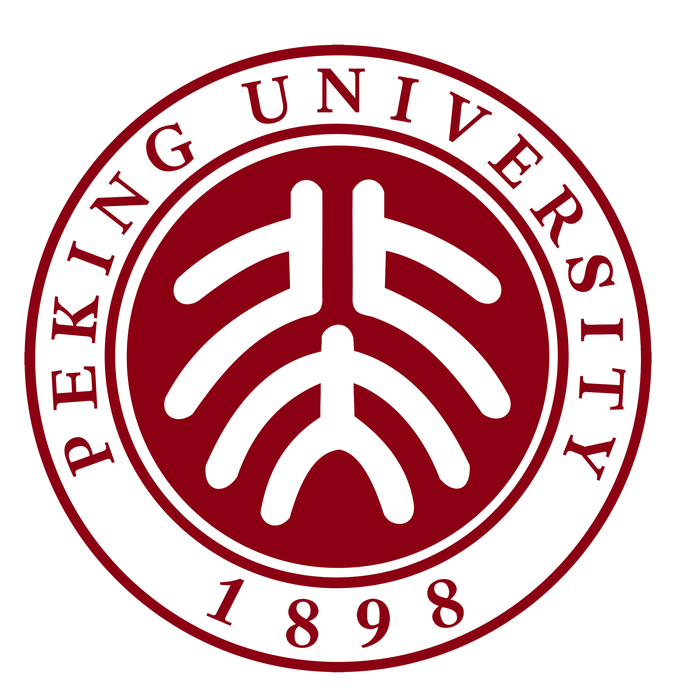
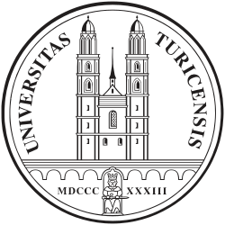

# PKU–Zurich PhD Summer School on Machine Learning for Macroeconomics and Finance (2026)

  
  &nbsp;&nbsp;&nbsp;&nbsp;
  

This is the official teaching repository for the **PKU–Zurich PhD Summer School on Machine Learning for Macroeconomics and Finance**, to be held in Beijing, China, **July 6–10, 2026**.

Lecture slides, code, and tutorial materials will be posted here as the school approaches.

- Summer School website: <https://liboecon.com/2026_summer_school.html>
- Tentative agenda: <https://liboecon.com/2026_summer_school_agenda.html>

**Organizers:** Felix Kübler (University of Zurich) · Bo Li (Peking University) · Yucheng Yang (University of Zurich)

---

## Tentative Agenda

### Day 1 — Monday, July 6, 2026 · *Deep Learning Basics* · [Materials](day1)

| Time | Session | Speaker | Topic |
|---|---|---|---|
| 09:00–10:30 | Lecture 1 | Serguei Maliar | Introduction to Deep Learning; Getting Started with TensorFlow / PyTorch / JAX |
| 11:00–12:30 | Lecture 2 | Serguei Maliar | Introduction to Heterogeneous-Agent Macroeconomics in Discrete Time |
| 12:30–14:00 | Lunch break | | |
| 14:00–15:30 | Lecture 3 | Serguei Maliar | Maliar–Maliar–Winant Method |
| 16:00–17:30 | Tutorial 1 | Serguei Maliar | Hands-on practice |

### Day 2 — Tuesday, July 7, 2026 · *Deep Equilibrium Nets* · [Materials](day2)

| Time | Session | Speaker | Topic |
|---|---|---|---|
| 09:00–10:30 | Lecture 4 | Simon Scheidegger | Deep Equilibrium Nets: Foundations |
| 11:00–12:30 | Lecture 5 | Simon Scheidegger | Deep Equilibrium Nets: Applications |
| 12:30–14:00 | Lunch break | | |
| 14:00–15:30 | Tutorial 2 | Simon Scheidegger | Hands-on practice |
| 16:00–17:30 | Lecture 6 | Felix Kübler | Gaussian Processes and Bayesian Numerical Methods |

### Day 3 — Wednesday, July 8, 2026 · *DeepHAM and Reinforcement Learning* · [Materials](day3)

| Time | Session | Speaker | Topic |
|---|---|---|---|
| 09:00–10:30 | Lecture 7 | Simon Scheidegger / Felix Kübler | Deep Surrogate Models and Deep Uncertainty Quantification |
| 11:00–12:30 | Lecture 8 | Yucheng Yang | DeepHAM Method |
| 12:30–14:00 | Lunch break | | |
| 15:00–16:30 | Lecture 9 | Benjamin Moll *(special online lecture)* | Structural Reinforcement Learning for Macroeconomics |
| 17:00–18:30 | Tutorial 3 | Yucheng Yang, Chiyuan Wang | Hands-on practice |

### Day 4 — Thursday, July 9, 2026 · *Deep Learning and Continuous-Time Macro-Finance* · [Materials](day4)

| Time | Session | Speaker | Topic |
|---|---|---|---|
| 09:00–10:30 | Lecture 10 | Goutham Gopalakrishna | Introduction to Continuous-Time Methods |
| 11:00–12:30 | Lecture 11 | Goutham Gopalakrishna | Deep Learning for Solving Partial Differential Equations (PDEs) |
| 12:30–14:00 | Lunch break | | |
| 14:00–15:30 | Lecture 12 | Goutham Gopalakrishna | Deep Learning for Macro-Finance Models |
| 16:00–17:30 | Tutorial 4 | Goutham Gopalakrishna | Hands-on practice |

### Day 5 — Friday, July 10, 2026 · *Deep Learning for Macro-Finance and Beyond* · [Materials](day5)

| Time | Session | Speaker | Topic |
|---|---|---|---|
| 09:00–10:30 | Lecture 13 | Jonathan Payne | Deep Learning for Continuous-Time Krusell–Smith Models |
| 11:00–12:30 | Lecture 14 | Jonathan Payne | Deep Learning for Search and Matching Models |
| 12:30–14:00 | Lunch break | | |
| 14:00–15:30 | Lecture 15 | Jonathan Payne | Deep Learning for Asset Pricing with Household Heterogeneity |
| 16:00–17:30 | Keynote | Weinan E | AI for Science |

---

## Contact

Academic inquiries: **Yucheng Yang** — `yucheng.yang@uzh.ch`

---

## License

Teaching materials in this repository are released under the [Creative Commons CC0 1.0 Universal](LICENSE) license, except where individual files state otherwise (e.g. third-party code retained under its original license).
